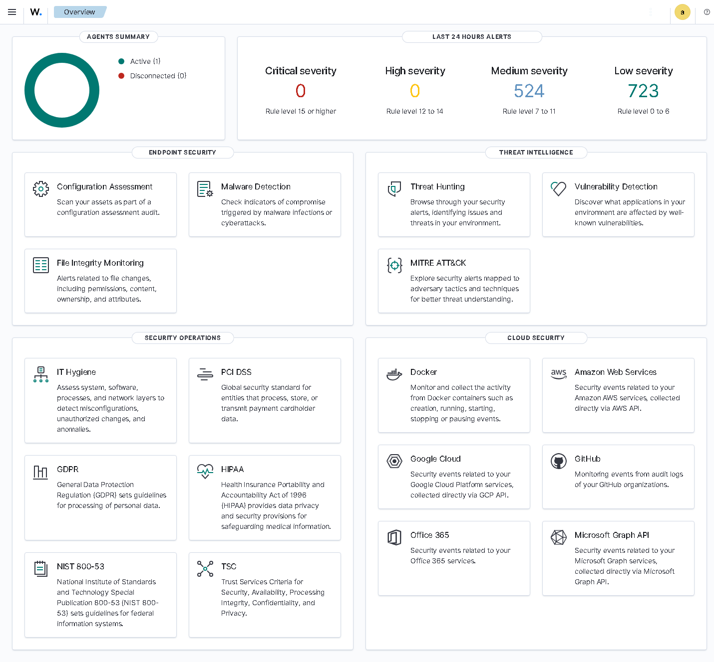
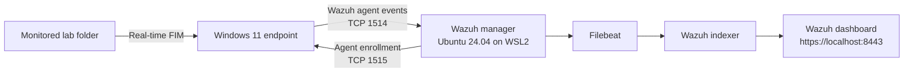
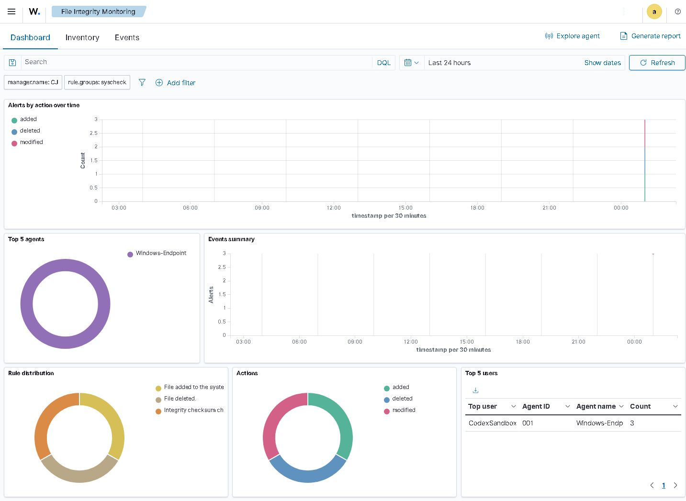
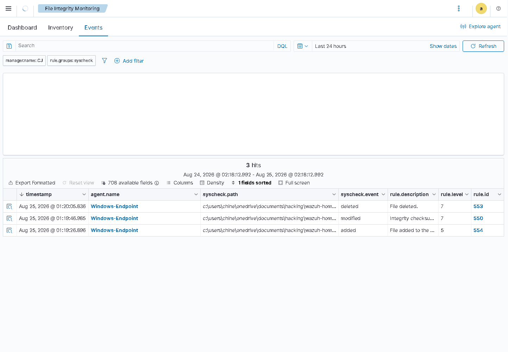

# Wazuh SIEM Home Lab

An operational Wazuh 4.14.7 security monitoring lab built on Windows 11. It uses an isolated Ubuntu 24.04 WSL2 environment for the Wazuh server components and a native Windows Wazuh agent for endpoint telemetry.



## What this project demonstrates

- Deployed and validated a Wazuh all-in-one SIEM stack: indexer, manager, Filebeat, and dashboard.
- Enrolled a Windows endpoint and confirmed an active agent connection.
- Configured real-time File Integrity Monitoring (FIM) on a controlled folder.
- Generated and detected create, modify, and delete events.
- Mapped detected activity to MITRE ATT&CK techniques, including T1565.001, T1070.004, and T1485.
- Preserved sanitized validation evidence while excluding credentials and raw logs from version control.

## Architecture



## Verified results

| Control | Result |
|---|---|
| Wazuh services | Indexer, manager, Filebeat, and dashboard active |
| Windows agent | `Windows-Endpoint`, agent ID `001`, active |
| Dashboard | Available locally at `https://localhost:8443` |
| FIM create test | Detected, rule 554, level 5 |
| FIM modify test | Detected, rule 550, level 7, MITRE T1565.001 |
| FIM delete test | Detected, rule 553, level 7, MITRE T1070.004 and T1485 |

The latest sanitized service and detection output is stored in [evidence/manager-status.txt](evidence/manager-status.txt).

## Real lab evidence

These screenshots were captured from the running local Wazuh instance after authenticating to the dashboard. They are not mock-ups or stock images.

### File Integrity Monitoring dashboard

The dashboard identifies one monitored Windows endpoint and three controlled FIM actions: added, modified, and deleted.



### Detection events

The events table records the actual test file, endpoint, event types, severity levels, and Wazuh rule IDs 553, 550, and 554.



## Operating the lab

Run these commands from this directory in PowerShell:

```powershell
powershell -ExecutionPolicy Bypass -File .\scripts\start-wazuh-lab.ps1
powershell -ExecutionPolicy Bypass -File .\scripts\show-dashboard-credentials.ps1
```

Open `https://localhost:8443`. The browser may warn about the lab's self-signed TLS certificate; only accept it for this local instance.

To repeat the controlled FIM demonstration:

```powershell
powershell -ExecutionPolicy Bypass -File .\scripts\test-fim.ps1
powershell -ExecutionPolicy Bypass -File .\scripts\collect-wsl-evidence.ps1
```

To refresh all three screenshots from the live dashboard, ensure Node.js and Microsoft Edge are installed, then run:

```powershell
node .\scripts\capture-dashboard.mjs
```

The capture uses an isolated temporary Edge profile, connects only to `https://localhost:8443`, reads the dashboard password from the Git-ignored private installation log, and closes the temporary browser when finished.

Stop the lab when it is not in use:

```powershell
powershell -ExecutionPolicy Bypass -File .\scripts\stop-wazuh-lab.ps1
```

## Security and design decisions

- The dashboard is bound to a local WSL environment and accessed through localhost.
- Wazuh uses TLS; the self-signed certificate is appropriate for a private lab but should be replaced by a trusted certificate in production.
- Credentials, installer logs, enrollment details, and original endpoint configuration are stored under `evidence/private/` and excluded by `.gitignore`.
- FIM targets a dedicated test directory, avoiding changes to production or personal files.
- WSL2 was selected after the VirtualBox route proved unstable under the host's Windows hypervisor configuration. This preserved isolation while producing a reliable, repeatable lab.

## GitHub publishing notes

- Commit `README.md`, `CV-BULLETS.md`, `scripts/`, `evidence/manager-status.txt`, and `evidence/screenshots/`.
- Never commit `evidence/private/`, `credentials.local.txt`, raw logs, Wazuh certificates, enrollment keys, or dashboard passwords.
- Review screenshot metadata and visible hostnames before publishing if you require full anonymity.
- The public scripts resolve the project directory dynamically instead of relying on a specific Windows username.

## Portfolio talking points

I designed and deployed a Wazuh SIEM lab, connected a Windows endpoint, and implemented real-time file integrity monitoring. I validated the full telemetry pipeline by generating controlled file create, modification, and deletion activity and confirming corresponding Wazuh alerts with MITRE ATT&CK mappings. I also documented operational procedures, protected credentials from source control, and captured reproducible evidence.

## Reference material

- [Wazuh quickstart](https://documentation.wazuh.com/current/quickstart.html)
- [Wazuh Windows agent installation](https://documentation.wazuh.com/current/installation-guide/wazuh-agent/wazuh-agent-package-windows.html)
- [Wazuh FIM advanced settings](https://documentation.wazuh.com/current/user-manual/capabilities/file-integrity/advanced-settings.html)
- The supplied `Wazuh-Guide.pdf` informed the original lab objectives; the implementation was adapted to the capabilities of this PC.
